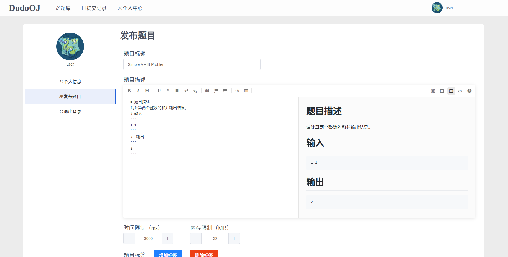
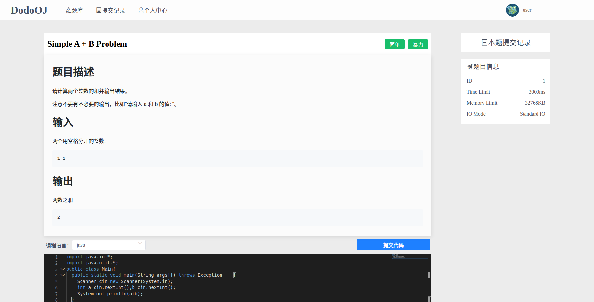
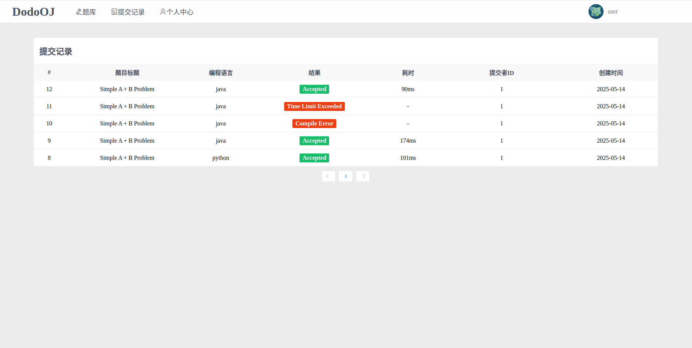
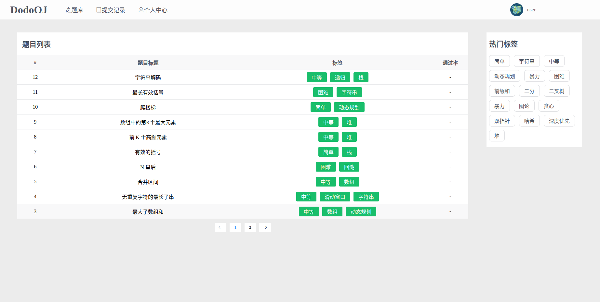

# DodoOJ

## 1.概述

    

> 一个小而全的OnlineJudge系统，基于java和Vue实现

项目文件结构

```sh
.
├── html         --界面
├── images       --文档图片
├── oj           --oj部分
├── sandbox4j    --代码沙箱
└── sql          --SQL语句
```

项目核心是判题沙箱，实现了本地代码沙箱和Docker代码沙箱，主要使用Docker沙箱，保证宿主机的安全

目前支持python和java，使用**模板方法模式**便于不同编程语言沙箱的拓展，详情可见其沙箱配置及拓展。

前端部分基于Vue2，支持Markdown编辑和语法高亮，并做了移动端适配









## 2.环境准备及其他说明

### 2.1安装Docker

官网教程地址：<a href="https://docs.docker.com/engine/install/ubuntu/">https://docs.docker.com/engine/install/ubuntu/</a>

```shell
#删除旧版本
sudo apt-get remove docker docker-engine docker.io containerd runc
#更新apt包索引并安装包，允许apt通过HTTPS使用存储库
sudo apt-get update
sudo apt-get install ca-certificates curl gnupg
#添加Docker官方GPG密钥
sudo install -m 0755 -d /etc/apt/keyrings
curl -fsSL https://download.docker.com/linux/ubuntu/gpg | sudo gpg --dearmor -o /etc/apt/keyrings/docker.gpg
sudo chmod a+r /etc/apt/keyrings/docker.gpg
#
echo \
  "deb [arch="$(dpkg --print-architecture)" signed-by=/etc/apt/keyrings/docker.gpg] https://download.docker.com/linux/ubuntu \
  "$(. /etc/os-release && echo "$VERSION_CODENAME")" stable" | \
  sudo tee /etc/apt/sources.list.d/docker.list > /dev/null
  
#安装最新版本
sudo apt-get install docker-ce docker-ce-cli containerd.io docker-buildx-plugin docker-compose-plugin
#查看版本验证是否成功安装
docker -v
#卸载
sudo apt-get purge docker-ce docker-ce-cli containerd.io docker-buildx-plugin docker-compose-plugin docker-ce-rootless-extras
sudo rm -rf /var/lib/docker
sudo rm -rf /var/lib/containerd
```

镜像加速器配置

```shell
#写入配置文件
sudo vim /etc/docker/daemon.json
#写入加速器地址
{
    "registry-mirrors": ["镜像仓库地址"]
}

sudo systemctl daemon-reload
sudo systemctl restart docker
```

### 2.2依赖镜像

```sh
# 判题所需镜像
docker pull openjdk:8-alpine
docker pull python:3.9-alpine
# mysql、redis镜像（可选）
docker pull mysql:5.7
docker pull redis:5.0
```

### 2.3 启动程序

后端标准的maven项目，可通过`mvn clean package`命令打包并使用`java`命令运行，也可在IDE中运行

前端基于Vue2实现

```sh
cd html
npm install
npm run serve
```

### 2.4沙箱配置及拓展

项目实现了本地沙箱和Docker沙箱，并实现了相应的沙箱模板类

拓展其他语言时只要继承模板并覆写提供编译、运行程序的命令的函数即可，以java Docker沙箱为例

```java
@Component
public class JavaDockerSandBox extends DockerSandBoxTemplate{

    @Override
    public String codeFileName(){
        return "Main.java";
    }

    @Override
    public String imageName(){
        return "openjdk:8-alpine";
    }

    @Override
    public String createCompileCmd(String filePath){
        return String.format("javac -encoding utf-8 %s", filePath);
    }

    @Override
    public String createRunCmd(String path){
        return String.format("java -Xmx256m -Dfile.encoding=UTF-8 -cp %s Main", path);
    }

```

沙箱url地址相关信息可在调用方的`application.yml`中配置

```java
codesandbox:
  java:
    host: 127.0.0.1
    port: 8081
  python:
    host: 127.0.0.1
    port: 8081
```

### 2.5docker命令需要root权限解决方法

```shell
# 检查docker用户组是否存在
sudo grep docker /etc/group
# 将当前用户追加进docker用户组
sudo usermod -aG docker $USER
```

